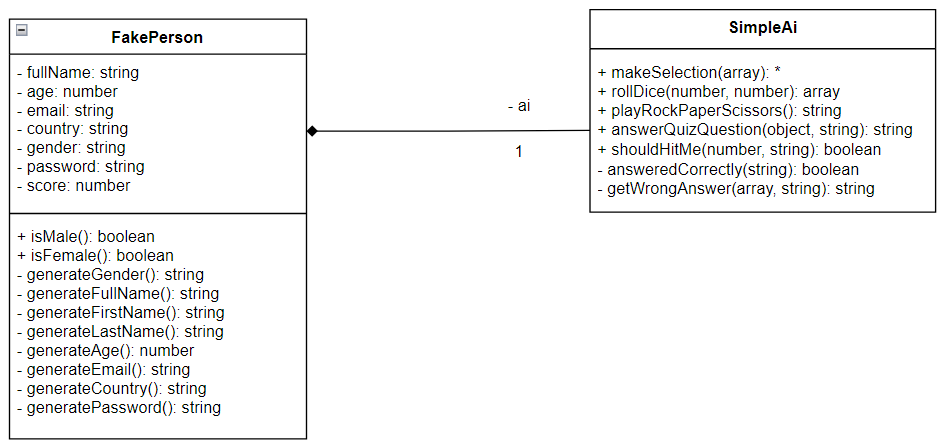

# Mall för inlämning laboration 1, 1dv610
​
## Checklista
  - [ ] Jag har skrivit all kod och reflektioner själv. Jag har inte använt mig av andras kod för att lösa uppgiften.
  - [ ] Mina testresultat är skrivna utifrån utförd testning ( och inte teoretiskt: "det bör fungera" :) )
  - [ ] Koden är objektorienterad
  - [ ] Jag har skrivit en modul som riktar sig till programmerare
​
## Egenskattning och mål
  - [ ] Jag är inte klar eftersom jag vet att jag saknar något. (Då skall du inte lämna in! Lämna då istället in på restlaboration.)
  - [ ] Jag eftersträvar med denna inlämning godkänt betyg (E-D)
    - [ ] De flesta testfall fungerar
    - [ ] Koden är förberedd på Återanvändning
    - [ ] All kod samt historik finns i git 
    - [ ] Kodkvaliterskraven är ifyllda
    - [ ] Reflektion är skriven utifrån bokens kapitel 
  - [ ] Jag eftersträvar med denna inlämning högre betyg (C-B) och anser mig uppfylla alla extra krav för detta. 
    - [ ] Samtliga testfall är skrivna    
    - [ ] Testfall är automatiserade
    - [ ] Det finns en tydlig beskrivning i hur modulen skall användas (i git)
    - [ ] Kodkvalitetskraven är varierade 
  - [ ] Jag eftersträvar med denna inlämning högsta betyg (A) 
​
Förtydligande: Examinator kommer sätta betyg oberoende på vad ni anser. 
​
## Återanvändning
<!-- *Beskriv hur du anpassat din kod och instruktioner för att någon annan programmerare skall kunna använda din modul. Om du skrivit instruktioner för din användare, länka till dessa. Om inte, beskriv här hur någon skall göra för att använda din modul.* -->

För att göra det lätt för andra utvecklare att använda min modul, så har jag publicerat det på npmjs.com. Därmed, kan man enkelt installera modulen som ett "dependency" i sin applikation genom att skriva `npm i fake-person` i terminalen.

För de som vill läsa källkoden, så är den organiserad i submoduler där varje funktion/metod och klass har tillhörande JSDOC som förtydligar dess syfte.

Utöver detta, har jag skrivit en [README](https://github.com/je223sv/1DV610-lab-1#readme) där jag går igenom hur man installerar modulen och använder dess publika metoder.
​
## Beskrivning av min kod
<!-- Beskriv din kod på en hög abstraktionsnivå. En kort beskrivning av dina viktigaste klasser och metoder. Skapa gärna ett klassdiagram som bild. Använd det ni lärt er så här långt i 1dv607. Kommunicera så att jag kan förstå. -->

Det finns två klasser i denna modul; `FakePerson` och `SimpleAi`. Med `FakePerson` skapas en “låtsas” person med slumpmässigt genererade egenskaper såsom namn, ålder och kön som kan användas när man behöver “dum” användardata.

Förutom att `FakePerson` är huvudklassen där all funktionalitet utgår ifrån, så är det även en komposit klass som använder sig av `SimpleAi` för metoder som kan användas för att simulera en AI i enklare spel såsom guess the number, the hanging man, rock paper scissors, frågesporter, black jack, osv.

Modulen har dessutom en “utility” och en “validations” submodul med funktioner som används flitigt av dessa klasser för att undvika repetition och för att säkerhetsställa att argument till funktioner är giltiga.

Se [README](https://github.com/je223sv/1DV610-lab-1#readme) för mer information.

## Hur jag testat
<!-- Beskriv hur du kommit fram till om din kod fungerar. -->

För att testa denna modul, så har jag använt testramverket **Jest** och skrivit automatiska enhetstester. Varje "submodul" har sin egna testfil som går att hitta i en `__tests__` map:

Mellan dessa testfiler finns det totalt 79 enhetstester:

Använd `npm test` kommandot i terminalen för att köra samtliga enhetstester och `npm lint` för att analysera kodstandarden.
​
### Testfall
Lista de enskilda testfallen. **Fetmarkera** sådant som du själv fyllt i. En rad per testfall. Om ni använder vertyg för testning kan ni ha en bild här med testrapporten. Tänk på att kommunicera till mig. Vad fungerar?, vad fungerar inte? Hur är det testat? Vilka delar testas inte?
​
| Vad testas      | input | output | utfall PASS/FAIL |
| --------- | --------- | ------ | ------- |
|           |           |        |         |
​
​
## Kodkvalitetskrav
​
**Fetmarkera** de "regler" som används ur CC. Ni kan frångå tabellformat om ni vill. Skapa direktlänkar till er kod där det är lämpligt. Skriv så att jag kan förstå.

​
### Namngivning
​
| Namn och förklaring  | Reflektion                                   |
| -------------------  | ---------------------------------------------|
| FakePerson           | Class name:                                  |
| makeSelection(options)        | Class name:                                  |
| rollDice(faces, numOfDice)             | Class name:                                  |
| playRockPaperScissor() | Class name:                                  |
| answerQuizQuestion({options, correctAnswer})   | Class name:                                  |
​
### Funktioner
​
| Metodnamn och förklaring  | Reflektion                                   |
| -------------------  | ---------------------------------------------|
|                      |                                              |
​
## Laborationsreflektion
Reflektera över uppgiften utifrån ett kodkvalitetsperspektiv. Använd begrepp ifrån boken. 